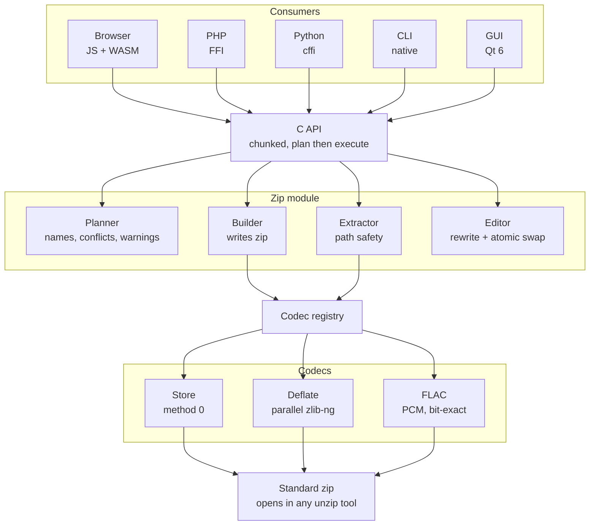
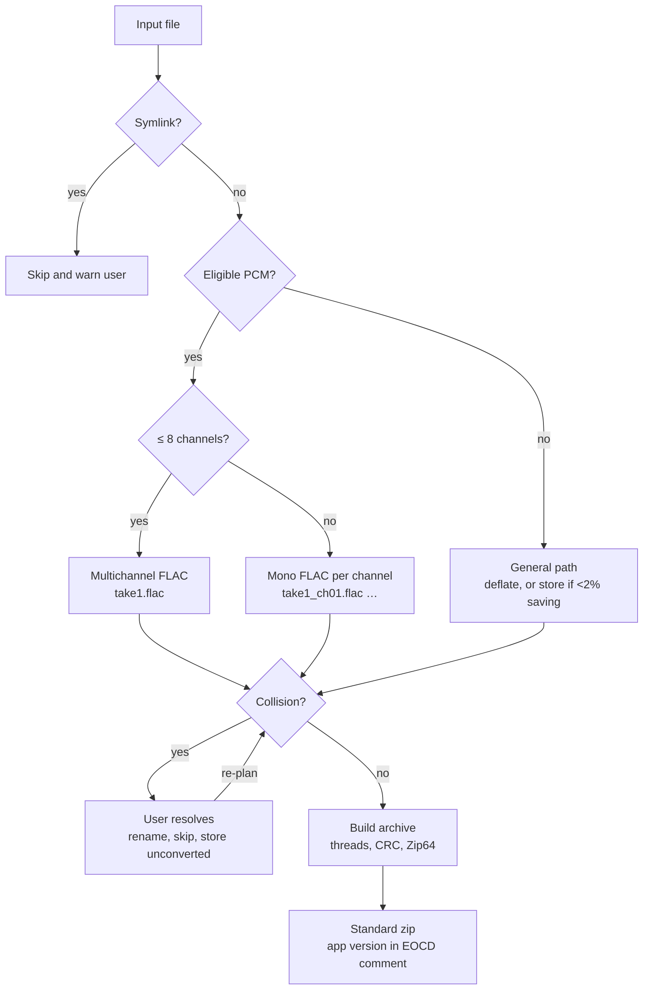
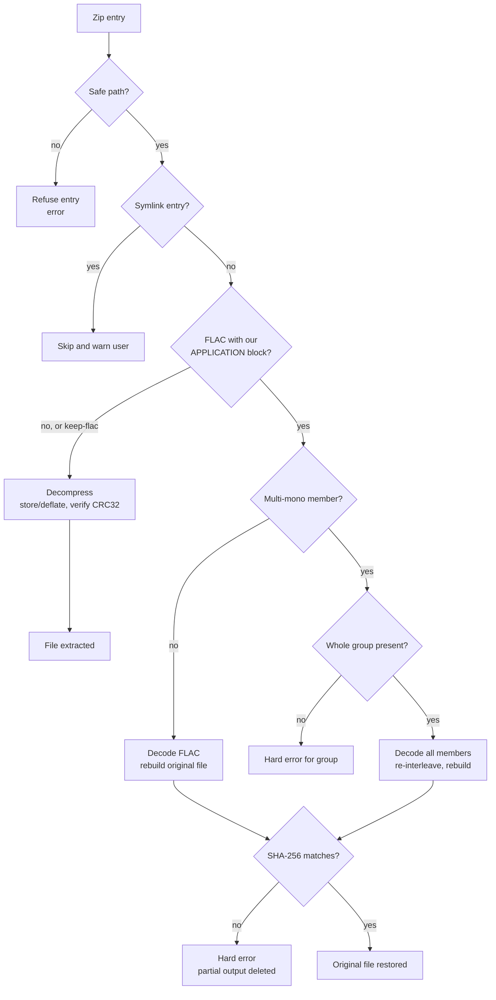
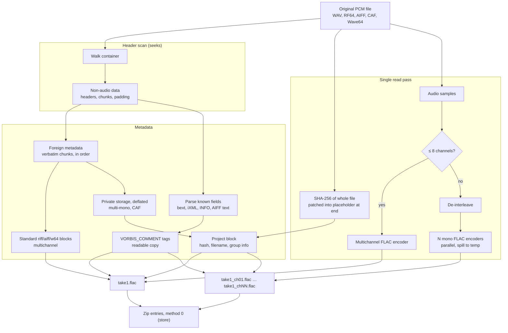
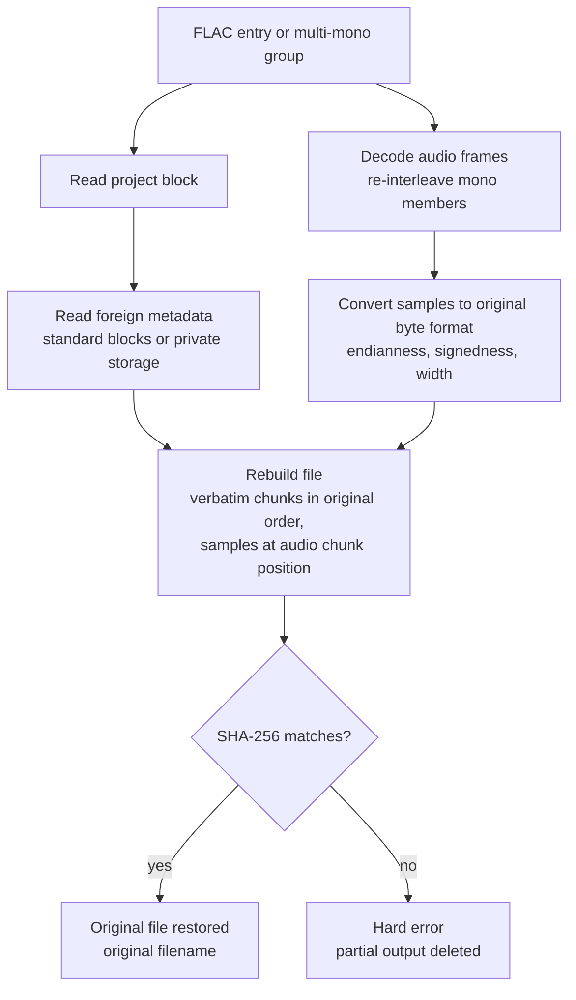

# Media Compression Library — Technical Specification

Status: draft v4.

## 1. Purpose

A cross-platform library for packaging professional media files for transfer as standard zip archives. PCM audio (WAV, RF64, AIFF, CAF, Wave64) is compressed losslessly with FLAC and reconstructed bit-exactly. All compression is lossless. The core is C++ and runs natively and in-browser (WebAssembly, no install), with JS, PHP and Python bindings plus a desktop CLI and GUI. Multi-GB files are handled by streaming.

Out of scope: network transfer (upload, resume, delivery). The library produces and consumes archives only.

License: dual, **AGPL-3.0** or commercial (Section 13).

### 1.1 Architecture Overview



### 1.2 Archiving Flow (per input file)



### 1.3 Extraction Flow (per entry)



## 2. Core Architecture

- C++ core, exposed only through a C API used by all bindings and apps.
- Streaming, chunk-based I/O. No API takes or returns a whole file in memory.
- Codecs implement internal `Encoder`/`Decoder` interfaces, selected via a codec registry.
- Threading: one core-owned thread pool per library context (reader, hasher, workers, ordered writer). Dependencies run single-threaded. Details in the zip design doc, Section 8.
- Compression and extraction are both in scope on every platform.
- Archive creation is two-phase:
  1. **Plan**: scan inputs, decide per-file method and output name, detect errors that need a user decision (collisions, Section 6.2) and warnings (skipped symlinks, Section 6.3). Returns the plan to the caller.
  2. **Execute**: runs only once the plan has no unresolved conflicts. The caller may override per-file decisions (rename, skip, disable FLAC conversion).

## 3. Platform Targets

- **Native**: CMake; Linux, macOS, Windows.
- **WebAssembly**: Emscripten, single pthread build.
  - Requires `SharedArrayBuffer`, so the host must send `Cross-Origin-Opener-Policy: same-origin` and `Cross-Origin-Embedder-Policy: require-corp`.
  - Core runs in a pthread pool inside a Web Worker.
  - WASM memory maximum sized for mobile (target ≤ 512 MB, tuned during the iOS spike).
- **Browsers**: Chromium, Firefox, Safari (desktop), Safari/WebKit on iOS, Chrome on Android. "Modern" = latest two major versions of each at release time.

## 4. Browser Data Flow

- Input: `File.slice()` reads, which are seekable (needed for the FLAC header scan, Section 7.2).
- Worker ↔ main thread: SharedArrayBuffer ring buffer.
- Output:
  - Chromium desktop: File System Access API (`showSaveFilePicker`), written directly.
  - All others (Firefox, Safari, iOS, Android): write to the Origin Private File System (OPFS) via a sync access handle in the worker, then hand the finished file to the user as a download. Requires free device storage ≥ output size and sufficient origin quota.
- Output is never fully buffered in memory.
- Browser extraction writes to a user-picked directory where supported, otherwise to individual file downloads.

## 5. Bindings

| Binding | Mechanism | Target |
|---|---|---|
| JS | Hand-written glue over C API exports; Promise/Streams API | WASM |
| PHP | PHP FFI (≥ 7.4); requires `ffi.enable` in deployment config | Native |
| Python | cffi over the C API | Native |

All bindings expose the same two-phase, chunked API.

## 6. Container: Zip

Maximum compatibility is the governing requirement. Archives must extract correctly with Info-ZIP `unzip`, macOS Archive Utility, Windows Explorer and 7-Zip.

- Library: **minizip-ng**, `MZ_ZLIB=ON` built against **zlib-ng**, `MZ_ZIP64=ON`, all other compression backends off.
- Write methods: store (0) and deflate (8) only. Read methods: store and deflate.
- Zip64 only when sizes/counts require it.
- Local headers: when output is seekable (native files, OPFS, File System Access), sizes and CRC are written into local headers by seeking back. Data descriptors are used only for non-seekable output. This avoids known issues in some extractors with streamed Zip64 archives.
- Filenames: UTF-8, general-purpose flag bit 11 set, NFC-normalized.
- Preserved per entry: relative path, modification time (extended timestamp field), Unix permission bits (including executable). Empty directories stored as directory entries.
- Not preserved: macOS extended attributes and resource forks. No `__MACOSX` entries are written.
- No load-bearing proprietary extra fields.

### 6.1 General Compression (non-PCM files)

- Deflate via **zlib-ng** (faster than stock zlib, fully standard deflate output), default level 6, configurable.
- Multithreaded: independent entries compress in parallel. Large single entries use pigz-style parallel deflate (independent blocks, output is a single valid deflate stream).
- Store heuristic: compress a sample of the first blocks; if the ratio is below a threshold (default: < 2% saving), store the entry instead. Already-compressed media then costs almost nothing.
- zlib-ng version, build options and parallel block size are pinned so output is deterministic across platforms. Its output bytes differ from stock zlib's, so stock zlib must never be substituted.

### 6.2 Entry Naming and Collisions

- FLAC-converted PCM files: `take1.wav` → `take1.flac`, or `take1_ch01.flac` … `take1_chNN.flac` for more than 8 channels (Section 7.2). Every generated name takes part in collision checks. The original filename (exact case and extension) is stored in the project block and restored on extraction.
- Files not converted keep their name.
- **Collisions are fatal until resolved by the user.** The plan phase reports every output path that collides, compared after NFC normalization and case-folding (so archives are safe to extract on case-insensitive filesystems). Execution is refused until each conflict has a caller-supplied resolution: rename, skip, or store the file unconverted.

### 6.3 Symlinks (not supported)

- **Archiving**: symlinks are never followed and never stored. The plan phase lists every skipped symlink as a warning, shown to the user before execution. The user can proceed without them or cancel.
- On Windows, junctions and other directory reparse points are treated as symlinks and skipped.
- Browsers don't expose symlinks to web pages; depending on the browser, a picked folder may include link targets' contents as regular files. This is accepted as a browser limitation.
- **Extraction** of third-party archives containing symlink entries: the entries are skipped and reported as warnings.
- **Path safety** (all extraction paths): reject entries whose paths escape the destination (`..`, absolute paths).

### 6.4 Archive Metadata (EOCD Comment)

```
[4-byte magic]
[1-byte schema version]
[2-byte length][UTF-8 application version string]
[2-byte length][UTF-8 name of the generated readme entry, empty if none]
```
Readers ignore comments without the magic.

### 6.5 Readme for Plain-Unzip Recipients

Every archive containing at least one FLAC-converted file gets a generated plain-text explanation at the archive root.

- Name: `README - How to restore original audio.txt`.
- Encoding: UTF-8 without BOM, CRLF line endings (opens correctly in Notepad, TextEdit and any text editor). Deflate-compressed like other files.
- Default content (template, English in v1):

```
Why are the audio files in this archive FLAC?

This archive was created with {APP_NAME} {APP_VERSION}.

To make the transfer smaller, uncompressed audio files were losslessly
compressed to FLAC. No audio quality has been lost. You can play and edit
the FLAC files as they are.

The original files - including all their metadata (timecode, scene/take
information, markers and everything else) - are stored inside the FLAC
files and can be restored bit-for-bit.

To get your original files back:
  1. Go to {DEARCHIVER_URL}
  2. Open this .zip file there. It runs in your web browser, is free,
     and needs no installation.
  3. Extract. Your original files are restored and verified.

Alternative for single .flac files (not *_chNN.flac sets): the free FLAC
command-line tool (https://xiph.org/flac/, version 1.4.3 or later) can
restore them:
  flac -d --keep-foreign-metadata take1.flac

Files that were converted:
  take1.flac                         -> take1.wav
  take2_ch01.flac ... take2_ch16.flac -> take2.wav (16 channels)
  ...
```

- The file list covers every converted file. Multi-mono groups are listed as one line.
- `{DEARCHIVER_URL}` points to the hosted browser build of this project, which is also the source-offer location for AGPL users (Section 13).
- Integrators can replace the template through the API (e.g. for branding or a different URL); the placeholders above stay available.
- The name takes part in collision checks like any other entry. A conflict with an input file must be resolved by the user (rename the input file or skip it); the readme itself is never renamed silently.
- Its modification time is the newest input file's modification time, so output stays deterministic.
- Extraction with this library skips the readme by default (identified via the EOCD comment), with an option to include it.
- The editor regenerates it when converted entries are added, removed or renamed, and removes it when none remain.

## 7. Compression Methods

**Principle:** for each file, choose specialised lossless compression when it is advantageous, otherwise deflate, otherwise no compression. A specialised codec is only adopted if it meets the criteria in Section 14.1.

### 7.1 Store

Passthrough. First implementation target. Also used for PCM files the FLAC path can't take (Section 7.2), with the reason recorded in the per-file result.

### 7.2 FLAC (PCM audio, bit-exact)

This path applies to **PCM audio data**, whatever container it arrives in, not only WAV.

**Supported PCM containers:**

| Container | Notes |
|---|---|
| RIFF WAV / BWF | including WAVE_FORMAT_EXTENSIBLE |
| RF64 / BW64 | > 4 GB, `ds64` chunk |
| AIFF | big-endian PCM |
| AIFF-C | uncompressed types only (`NONE`, `sowt`, `twos`) |
| CAF | `lpcm` integer only; 64-bit chunk sizes, `data` size −1 (to EOF) allowed |
| Sony Wave64 | 16-byte GUID chunk IDs, 64-bit sizes, 8-byte chunk alignment |

Anything else (headerless raw PCM, compressed or float audio) is stored.

**Encoding choice** (decided at plan time by a header-only scan; first match wins):

1. **Multichannel FLAC**: eligible PCM with ≤ 8 channels → one file, `take1.flac`.
2. **Multiple mono FLACs**: eligible PCM with > 8 channels → one mono file per channel, `take1_ch01.flac` … `take1_chNN.flac` (zero-padded to the width of the channel count, minimum 2 digits).
3. **Store**: everything else, with the reason recorded and shown as a warning.

**Eligible PCM** means all of the following:
- Clean container parse with a valid audio data size.
- Integer PCM, 4–32 bits per sample. IEEE float is not FLAC-encodable.
- Sample rate ≤ 1,048,575 Hz (FLAC STREAMINFO limit).
- Total samples per channel < 2^36 (FLAC STREAMINFO limit).
- Every non-audio chunk fits a FLAC metadata block (≤ 16 MiB − 4 bytes). For layouts using private storage (below), the uncompressed private data must also fit.
- Seekable input source.

**Metadata handling.** Every byte of the original file that isn't an audio sample is non-audio data: container header, format chunks, `bext`, `iXML`, markers, unknown or proprietary chunks. It is handled in two independent ways:

- **Foreign metadata (authoritative, exact).** Stored using FLAC's standard *foreign metadata storage* format, the same one the official `flac` tool writes with `--keep-foreign-metadata`: one APPLICATION block per chunk, in original order, each chunk copied verbatim, except the outer container chunk and the audio chunk, of which only the headers are copied. Standard application IDs: `riff` (WAV, RF64), `aiff` (AIFF, AIFF-C), `w64 ` (Wave64). Chunks are never parsed and regenerated for reconstruction, so chunks the library doesn't understand survive untouched. Because the format is standard, single-file FLACs can also be restored by the free `flac` tool (≥ 1.4.3): `flac -d --keep-foreign-metadata take1.flac`.
- **Mirrored tags (convenience, lossy).** Known fields parsed out of `bext`, `iXML`, `LIST`/`INFO` and AIFF text chunks and written as standard Vorbis comments, so any player or DAW can show them. Never used for reconstruction.

On top of the standard blocks, one **project APPLICATION block** carries what the standard format lacks: whole-file hash, original filename, multi-mono grouping, and any bytes the standard scheme can't represent.

**Layouts:**

| Layout | Used for | Foreign metadata stored in | Restorable with `flac -d` |
|---|---|---|---|
| 0: standard | Multichannel WAV, RF64, AIFF, AIFF-C, Wave64 | Standard `riff`/`aiff`/`w64 ` blocks | Yes |
| 1: multi-mono member | > 8 channels, any container | Project block of `_ch01` (private storage) | No |
| 2: private | CAF (no standard FLAC ID exists) | Project block (private storage) | No |

Multi-mono members don't use the standard blocks, because they describe the original multichannel file and `flac` would reject them as inconsistent with a mono stream. **Private storage** uses the same per-chunk representation as the standard format, concatenated and deflate-compressed, so one chunk reader/writer serves all layouts.

**Project APPLICATION block:**
```
[4-byte application ID]        project ID, registered with Xiph
[1-byte schema version]
[1-byte layout]                0 = standard, 1 = multi-mono member, 2 = private
[16-byte group ID]             random; identical across a multi-mono group; zero otherwise
[2-byte channel index]         1-based; 1 unless multi-mono
[2-byte channel count]         channels in the original file
[2-byte length][UTF-8 original filename]
[4-byte length][private chunk data, deflate-compressed]   layout 2, and layout 1 in _ch01 only; else empty
[4-byte length][trailing bytes]   bytes after the last chunk that no chunk contains; usually empty
[32-byte SHA-256 of original file]
```

Block order in each FLAC file: `fLaC` → STREAMINFO → VORBIS_COMMENT → standard foreign blocks (layout 0) → project block → audio frames.

**Encode (single pass, hash patched afterwards):**
1. **Header scan** (seeks only, no full read): walk the container and read every non-audio chunk, including chunks after the audio, by seeking to them. All metadata blocks are complete before any audio is encoded.
2. **Write metadata** with a 32-byte zeroed placeholder where the SHA-256 goes.
3. **Single read pass**: stream the whole file in order, feeding every byte to SHA-256 and the audio samples to the encoder.
   - Multichannel: the audio is cut into fixed-size segments encoded in parallel by single-threaded libFLAC encoders; frames are renumbered and joined in order (zip design doc, Section 8).
   - Multi-mono: de-interleave and feed N mono encoders in parallel (up to the thread limit). Because zip entries are written sequentially, each mono stream is spilled to temporary storage (temp dir natively, OPFS in the browser), then copied into the archive in channel order. Extra temporary space ≈ compressed size of the group.
4. **Patch**: seek back and overwrite the placeholder with the final hash. STREAMINFO (MD5, frame sizes) is patched at the end in the same way.
5. **Zip CRC32**: the entry CRC is computed as three segments (before, placeholder, after) and recombined with the real hash bytes using zlib-ng's `crc32_combine`, so no re-read is needed. The local header is then patched as usual (Section 6).

Requirements and fallback:
- The input must be seekable (all supported sources are: native files, browser `File`).
- Patching needs seekable output. Native files, OPFS and File System Access are all seekable, so this is the normal path. Multi-mono members are patched in their temp files before being copied in, so they always use it.
- Non-seekable output (e.g. CLI writing to stdout, a binding streaming to a network response): fall back to **two passes**, where pass 1 reads the whole file to compute the hash and pass 2 encodes.

**Implementation note.** The foreign metadata format is implemented from its published specification. The `flac` command-line tool's implementation is GPL and must not be copied (dual licensing, Section 13); libFLAC itself (BSD) is used only for encoding, decoding and metadata block I/O.

**Extract:**
- Default: decode, rebuild the original container byte-for-byte from the foreign metadata, restore the original filename from the project block, verify SHA-256. A mismatch is a hard error and the partial output is deleted.
- Multi-mono: all members sharing a group ID are decoded together and re-interleaved into one file. A missing, duplicate or mismatched member (channel count, sample count, hash) is a hard error for that group. Selecting any member for extraction pulls in the whole group.
- Option `keep-flac`: extract FLAC files as-is, mono or multichannel.
- `flac -d` restoration (layout 0) is a convenience for recipients without this library. It restores the original container and chunks but not the original filename, and doesn't check the whole-file hash; only this library's extraction guarantees bit-exact, verified output.

**Process diagrams.**

Compression:



Extraction:



Vorbis comment tags are not read during extraction.

**Encoder:** libFLAC ≥ 1.4, used single-threaded (the core does the parallelism), default level 5, configurable. FLAC files over 4 GB are stored with Zip64.

**Mirrored tags.** Key fields are copied into standard FLAC `VORBIS_COMMENT` tags, so recipients without this library still see them. Only the foreign metadata is used for reconstruction. Tags never affect the rebuilt file.

| Source | Vorbis comment |
|---|---|
| `bext` Description | `DESCRIPTION` |
| `bext` Originator / OriginatorReference | `ORIGINATOR`, `ORIGINATOR_REFERENCE` |
| `bext` OriginationDate / OriginationTime | `DATE` (ISO 8601), `ORIGINATION_DATE`, `ORIGINATION_TIME` |
| `bext` TimeReference | `TIME_REFERENCE` (samples since midnight) |
| `iXML` PROJECT, SCENE, TAKE, TAPE, NOTE, CIRCLED | `PROJECT`, `SCENE`, `TAKE`, `TAPE`, `NOTE`, `CIRCLED` |
| `iXML` track names | multichannel: `TRACK_NAME_01`… one per channel; multi-mono: `TRACK_NAME` for that channel |
| `LIST`/`INFO` INAM, IART, ICMT; AIFF `NAME`, `AUTH`, `ANNO` | `TITLE`, `ARTIST`, `COMMENT` |
| — | `ENCODER` = application name and version |

- Multi-mono members also get `CHANNEL` (index) and `CHANNELS` (total), plus all take-level tags.
- Missing source fields produce no tag.
- Field names beyond the standard Vorbis set follow de-facto conventions; the implementing team verifies which names target DAWs and asset managers read, and adjusts the table.
- Cue/marker chunks are not mirrored in v1.

**Plain tools:** standard unzip tools extract `take1.flac` or the `take1_chNN.flac` set, which play in standard players. Multi-mono sets import into DAWs the same way as mono files from a field recorder. Single-file FLACs (layout 0) can additionally be restored with the free `flac` tool.

## 8. Dependencies

| Dependency | Use | License |
|---|---|---|
| minizip-ng | Zip read/write | zlib |
| zlib-ng | Deflate, CRC32, private metadata storage | zlib |
| libFLAC ≥ 1.4 | FLAC encode/decode, single-threaded | BSD-3 |
| SHA-256 (implementer's choice) | Integrity | Must be permissively licensed and build for WASM |
| utf8proc | NFC normalization, case folding | MIT |
| Qt 6 Widgets | GUI | LGPL-3 |
| CLI11 | CLI | BSD-3 |

All are permissively licensed (or LGPL for Qt, GUI only), so both the AGPL and the commercial license are possible. Core dependencies must be permissive: no GPL/AGPL/LGPL code in `core/` or the bindings. All core dependencies must build under Emscripten with pthreads.

## 9. Repository Layout

```
core/
  include/            C API
  src/io/             chunked streams
  src/io/zip/         builder, reader, editor, planner
  src/codecs/         store, deflate, flac
build/native/  build/wasm/
bindings/js/  php/  python/
desktop/cli/  gui/
tests/fixtures/
```

## 10. Implementation Order

1. Zip layer: store, plan/execute, collisions, symlink skipping, path safety. Native only.
2. WASM build of step 1, plus an early spike: multi-GB output via OPFS on iOS Safari and Android Chrome. This is the highest-risk target.
3. Deflate, including parallel deflate and store heuristic.
4. FLAC path: WAV multichannel, then RF64, multi-mono, AIFF/AIFF-C, CAF, Wave64.
5. PHP and Python bindings.
6. CLI, then GUI.

## 11. Testing

### 11.1 Unit (native)

- Chunk API boundaries.
- Zip fields: Zip64 thresholds, seek-back vs. data-descriptor paths, UTF-8 flag, NFC normalization, EOCD comment round-trip and foreign-comment tolerance.
- Readme: generated only when FLAC entries exist; file list covers multichannel and grouped multi-mono entries; CRLF/UTF-8; custom template substitution; name collision reported.
- Collision detection: exact, case-only, and Unicode-normalization-only duplicates; `.wav`→`.flac` vs. existing `.flac`; generated `_chNN` names vs. existing files.
- Path safety: `..` and absolute paths rejected.
- Symlinks: skipped on archiving and on extraction, each reported as a warning.
- Deflate: round-trip; identical output across thread counts; store heuristic threshold.
- Container parsers (WAV, RF64, AIFF, AIFF-C, CAF, Wave64) against the fixture corpus, covering every store reason and the ≤ 8 / > 8 channel split.
- Foreign metadata blocks match the published FLAC foreign metadata specification; project block layout byte-exact; private storage round-trip.
- SHA-256 known vectors.

### 11.2 Integration (native)

- Store, deflate, multichannel FLAC and multi-mono FLAC pipelines round-trip byte-identical, for every supported container, including RF64 > 4 GB.
- Multi-mono: missing, duplicated and foreign group members are hard errors; extracting one member pulls in the group; temporary spill space is cleaned up on success, failure and cancel.
- Multi-GB input under a memory cap.
- Plan/execute: unresolved collisions block execution; each resolution type works.
- C API, PHP and Python produce byte-identical archives.
- Linux, macOS and Windows produce byte-identical archives.

### 11.3 End-to-End

- Browser compress/extract on every target browser, including iOS and Android, with a multi-GB file via the OPFS path. Output byte-identical to native.
- Browser fails with a specific error when COOP/COEP headers are missing.
- Archives extract with Info-ZIP `unzip`, macOS Archive Utility, Windows Explorer and 7-Zip.
- Extracted FLACs (multichannel and mono sets) play in standard players (VLC, ffplay) and show mirrored tags.
- Interoperability with the official `flac` tool (≥ 1.4.3): `flac -d --keep-foreign-metadata` on every layout-0 fixture restores a byte-identical file; files encoded by `flac --keep-foreign-metadata` are restored correctly by this library.
- The readme opens correctly in Notepad, TextEdit and gedit after plain-unzip extraction, and its URL leads to the working browser de-archiver.
- Extraction with this library skips the readme by default; editor add/remove of converted files regenerates or removes it.
- Scripted browser user flow (Playwright), including the collision-resolution UI.
- CLI round-trip, exit codes and error handling on all three OSes.
- GUI: manual test pass per release per OS.

### 11.4 Fixtures and CI

- PCM corpus (WAV unless noted):
  - PCM at 8, 16, 24 and 32 bits; float
  - WAVE_FORMAT_EXTENSIBLE; more than 8 channels
  - `bext`, `iXML`, `cue `, `LIST` chunks, and chunks after `data`
  - odd-length chunks, trailing bytes, placeholder `data` size
  - RF64/BW64, including a file over 4 GB (generated)
  - AIFF, AIFF-C (`NONE`, `sowt`, compressed type), CAF (`lpcm` int, float, `data` size −1), Wave64
  - unknown/proprietary chunks, which must round-trip byte-identical
  - 9, 16 and 64 channels; sample rates up to 768 kHz
- Deterministic generator for multi-GB inputs.
- Third-party zips: deflate, Zip64, non-UTF-8 names, symlink entries, malicious paths.
- Input directory containing symlinks (file and directory links, broken links).
- CI: unit and integration tests on every change on all three OSes; browser E2E (including mobile) before merge to main.

## 12. Desktop Applications

Both link the native library.

### 12.1 CLI

- Create, extract, list and edit archives; `--keep-flac` on extract; method and level options.
- Collisions: exit with a dedicated code and list the conflicts. Resolutions go in flags or a resolution file (JSON), so the CLI remains scriptable.
- Skipped symlinks: printed as warnings. Interactive runs ask to proceed; `--yes` proceeds non-interactively.
- Per-file results including fallback reasons; progress; JSON output option.

### 12.2 GUI (Qt 6 Widgets)

- Create archives with method options, progress and per-file results. Work runs off the UI thread.
- Collisions and skipped-symlink warnings shown in a dialog before execution.
- Archive browser (File Roller-style):
  - Open any zip; tree view showing name, size, compressed size, method, date, entry type. Listing reads only the central directory.
  - Extract all, selected entries, or a single file with the default app.
  - Edit: add, delete, rename, replace. Implemented in core (`ZipArchiveEditor`) as rewrite to a temp file plus atomic replace, and exposed via the C API.
  - Shows which FLAC entries can be restored to their original file, grouping multi-mono sets as one item.
  - Drag and drop in and out.

### 12.3 Packaging

| Platform | Format |
|---|---|
| Linux | AppImage and `.deb` |
| macOS | Signed, notarized `.app` in `.dmg` |
| Windows | Signed MSI |

Signing certificates and an Apple developer account are release prerequisites.

## 13. Licensing (dual: AGPL-3.0 or commercial)

Every component (core, bindings, CLI, GUI, browser app) is offered under either:
- **AGPL-3.0**: free; users who distribute or offer it over a network must publish their source, including modifications.
- **Commercial license**: for closed-source and proprietary products, with no source-disclosure obligation. Terms and pricing are outside this spec.

Requirements that keep dual licensing possible:
- **Copyright ownership.** The project owner must hold the rights to relicense all code. A CLA granting those rights is required before any external contribution is merged (e.g. CLA Assistant on pull requests). Code copied from elsewhere is only allowed under a permissive license.
- **Dependency policy.** Core and bindings use permissive dependencies only (zlib, BSD, MIT, Apache-2.0). Any new dependency needs a license check before adoption. GPL/AGPL/LGPL code is never linked into the core.
- **Qt (GUI only)** is used under LGPL-3 in both editions: link dynamically, allow relinking, ship Qt's notices. If a commercial customer needs a statically linked GUI, that requires a commercial Qt license on their side.
- **AGPL obligations for our own deployments.** The hosted browser app links to its corresponding source, per AGPL §13.
- **No copied GPL code.** Formats implemented by GPL tools (e.g. FLAC foreign metadata in the `flac` CLI) are implemented from their published specifications only.
- **License headers** (SPDX: `AGPL-3.0-only OR LicenseRef-Commercial`) in every source file; `LICENSE` and `COMMERCIAL.md` at the repository root.

## 14. Roadmap (not v1)

- **WavPack**, if there is demand: lossless float PCM and other formats FLAC can't take, which are currently stored.

### 14.1 Specialised Codec Candidates

A codec joins the archiver only if it meets all of:
1. **Real gain**: clearly smaller than deflate on representative real files.
2. **Speed**: encode and decode throughput comparable to deflate or better (FLAC beats it); measured by benchmark, not assumed.
3. **Bit-exact restoration** of the original file, verified by whole-file SHA-256, as for PCM.
4. **Usable without this tool**: the converted file opens in widely available tools for its domain, so plain-unzip recipients still get usable data.
5. **Licensing and portability**: permissive license (Section 13) and builds for WASM.

| Candidate | Gain vs. deflate | Open questions against the criteria |
|---|---|---|
| LiDAR LAS → LAZ | Typically ~10–20% of original size | LASzip is LGPL: needs laz-rs (MIT/Apache) or own implementation. Whole-file bit-exact restoration to verify. |
| JPEG → JPEG XL (lossless recompression) | ~20% smaller, reversible to the exact JPEG | `.jxl` support in recipient tools is limited; may suit opt-in rather than automatic. Speed to benchmark. |
| DPX/TIFF/EXR sequences → FFV1 (RAWcooked approach) | Often ~50% for uncompressed frames | Slower per core (parallelises well). Matroska/FFV1 poorly supported in editing tools. Main implementation is LGPL (FFmpeg). Largest value for media, largest effort. |

Evaluated and rejected, because they fail criterion 3 or 4: byte-shuffle filters, BCJ executable filters, precomp/preflate (output unusable without this tool), CRAM and DICOM transfer-syntax conversion (no byte-identical restoration), and columnar/time-series/log formats such as Parquet, Gorilla and CLP (different storage formats, not reversible packing).

- **Archive encryption.** Note: WinZip AES (AE-2) is secure but not supported by Windows Explorer or macOS Archive Utility; the universally supported ZipCrypto is cryptographically broken. Encryption will therefore conflict with the maximum-compatibility requirement, and the trade-off must be decided when this is scheduled.

## 15. Risks

- SHA-256 is sequential and may cap FLAC throughput, especially in WASM without CPU SHA instructions; benchmark early.

- iOS/Android: multi-GB output depends on OPFS quota and free storage; tab memory limits are tight.
- FLAC encoding to non-seekable output falls back to two passes, doubling input reads.
- Multi-mono spill needs temporary disk space ≈ compressed size of the group; on mobile browsers this competes with OPFS quota.
